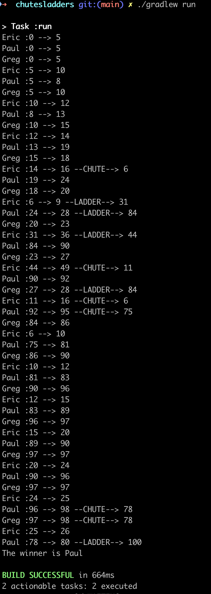

# ChutesAndLadders
Chutes and ladders game for code challenge

## Get Started
### Prerequisites
1. Install Java
2. Install Gradle

### Run app with Gradle:
Run command `./gradlew run`

### Run app in Intellij:
Go to `ChutesAndLaddersApplication.java` and run the main method

### Example Output:

